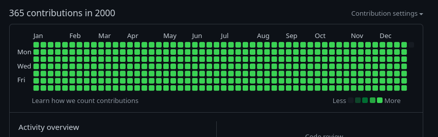

# Fill you github graph (check the year 2000 on my profile)

# Setup
To set up, update start and end date on `setup.sh` then run it.

# Rollback

To rollback everything run: `rollback.sh`, it will remove all commit and re-initialize the repo
